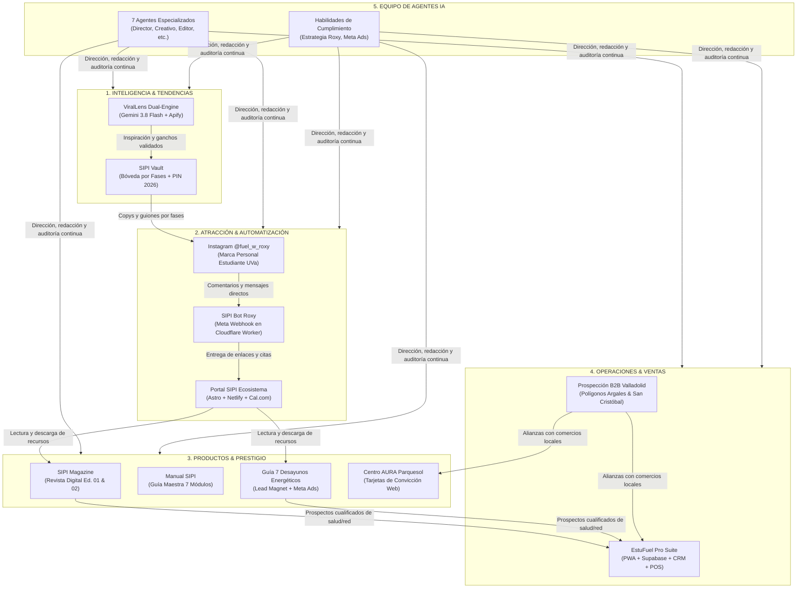

# 🗺️ Bitácora Oficial del Ecosistema SIPI & Directorio Maestro de Herramientas

> **Guía Maestra de Arquitectura, Operación, Ubicación e Interrelación de Herramientas Digitales.**  
> *Ecosistema @fuel_w_roxy · Sistema SIPI · EstuFuel · Centro AURA Valladolid*

---

## 📌 Mapa Conceptual del Ecosistema

El ecosistema está concebido como un **embudo integral de atracción, conversión, fidelización y duplicación**, donde cada herramienta cumple una función estratégica definida:

---

## 🧭 Índice de Herramientas Registradas

1. [Pilar 1: Inteligencia de Mercado & Minería Viral](#pilar-1-inteligencia-de-mercado--minería-viral)
   - 1.1. ViralLens Dual-Engine
   - 1.2. SIPI Vault
2. [Pilar 2: Atracción, Redes Sociales & Automatización](#pilar-2-atracción-redes-sociales--automatización)
   - 2.1. Canal de Instagram @fuel_w_roxy
   - 2.2. Fan Page de Facebook (Crece con Roxy)
   - 2.3. SIPI Bot Roxy (Meta Webhook Serverless)
   - 2.4. Portal Web SIPI Ecosistema
3. [Pilar 3: Publicaciones Editoriales, Lead Magnets & Bienestar](#pilar-3-publicaciones-editoriales-lead-magnets--bienestar)
   - 3.1. SIPI Magazine (Revista Digital)
   - 3.2. Manual SIPI (Producto Digital Terminado)
   - 3.3. Guía 7 Desayunos Energéticos (Lead Magnet)
   - 3.4. Centro AURA Parquesol & Generador de Tarjetas de Convicción
4. [Pilar 4: Operaciones Comerciales, CRM & Gestión de Ventas](#pilar-4-operaciones-comerciales-crm--gestión-de-ventas)
   - 4.1. EstuFuel Pro Suite (Plataforma Core)
   - 4.2. Herbalife Sales Manager (Precursor Financiero)
   - 4.3. EstuFuel Prospect Manager (Precursor CRM)
   - 4.4. Sistema de Prospección B2B Valladolid
5. [Pilar 5: Motor de Agentes de IA & Habilidades Especializadas](#pilar-5-motor-de-agentes-de-ia--habilidades-especializadas)
   - 5.1. Equipo de 7 Subagentes Orquestados
   - 5.2. Habilidades de Marca y Compliance

---

## Pilar 1: Inteligencia de Mercado & Minería Viral

### 1.1. ViralLens Dual-Engine
* **¿Qué es?:** Plataforma de software analítico para detectar publicaciones y reels atípicos (*outliers*) en TikTok e Instagram, despiezando su narrativa, hooks visuales y transcripciones segundo a segundo mediante inteligencia artificial multimodal.
* **Infraestructura Cloud:**
  - **Hosting:** Streamlit Community Cloud (Contenedor Linux Debian, Python 3.12).
  - **URL de Producción:** [https://virallens-roxy.streamlit.app](https://virallens-roxy.streamlit.app)
  - **Repositorio GitHub:** [oredigital2023/virallens-dual-engine](https://github.com/oredigital2023/virallens-dual-engine) (Rama: `main`, CI/CD automático en cada push).
* **Integraciones y Servicios Vinculados:**
  - **Google Gemini 3.8 Flash (`gemini-3.8-flash`):** Motor de visión multimodal para descomponer vídeos y carruseles frame a frame, extraer psicología de retención y redactar teleprompter.
  - **Apify Cloud API (Free Tier):** Extracción pública de posts recientes y métricas de creadores en Instagram y TikTok evitando bloqueos IP.
  - **SQLite + JSON Seed (`storage/seed_swipe_file.json`):** Persistencia blindada del Swipe File contra reinicios efímeros del contenedor en Streamlit Cloud.
* **Ubicación Local:** `ViralLens Dual-Engine/`
* **¿Para qué sirve?:** Para no inventar contenido desde cero, sino identificar con precisión matemática qué está funcionando en el mercado de bienestar, hábitos y emprendimiento, adaptándolo al canal de Roxy.
* **Cómo se usa:**
  1. Entra a la web e introduce una palabra clave (ej. `#emprenderjoven`, `#habitosaludables`) o el `@usuario` de un creador.
  2. Revisa el *Radar de Detección* con los posts ordenados por puntuación de anomalía (*Outlier Score*).
  3. Pulsa en *"Analizar con Gemini"* para obtener el guión técnico, ganchos visuales y psicología de retención.
  4. Guarda el análisis en el *Swipe File* y descarga la ficha en Markdown o ensambla el carrusel PNG.
* **Interrelación:** Alimenta a **SIPI Vault** con ideas probadas. Cuando una idea de ViralLens se adapta para Roxy, se cataloga en la Bóveda por su fase de madurez.

---

### 1.2. SIPI Vault (Bóveda Estratégica & Bitácora Operativa)
* **¿Qué es?:** Centro de control y repositorio de ideas, copys listos para publicar, prompts de imagen, guiones de prospección por DM clasificados por Fases de Madurez (Fase 1: Siembra, Fase 2: Tracción - Octubre, Fase 3: Escala) y Bitácora integral de herramientas.
* **Infraestructura Cloud:**
  - **Hosting:** GitHub Pages (CDN Global de alta velocidad con certificado SSL).
  - **URL de Producción:** [https://oredigital2023.github.io/sipi-vault/](https://oredigital2023.github.io/sipi-vault/)
  - **Repositorio GitHub:** [oredigital2023/sipi-vault](https://github.com/oredigital2023/sipi-vault) (Rama: `main`).
  - **Seguridad:** Bloqueo y autenticación con PIN de 4 dígitos (`2026`) almacenado en `localStorage`.
* **Integraciones y Servicios Vinculados:**
  - **GitHub Pages CDN:** Distribución web sin coste de servidor y accesible desde cualquier dispositivo móvil o de escritorio.
  - **Agentes IA de Antigravity:** Suministro directo y estructuración continua de nuevas estrategias de prospección y copys.
* **Ubicación Local:** `sipi-vault/` (y puntero maestro en raíz: `BOVEDA_ESTRATEGIAS_ROXY.md`).
* **Cómo se usa:**
  1. Roxy abre el enlace en su móvil y teclea `2026`.
  2. Alterna entre la pestaña *💡 Bóveda de Ideas* y *🗺️ Bitácora del Ecosistema*.
  3. Pulsa *"Copiar Caption"* para pegarlo directamente en Instagram, o *"Copiar DM"* para responder a prospectos.
* **Interrelación:** Es el puente entre el análisis de mercado de **ViralLens**, la creatividad de los **Agentes IA** y la publicación real en **Instagram (@fuel_w_roxy)**.

---

## Pilar 2: Atracción, Redes Sociales & Automatización

### 2.1. Canal de Instagram Oficial: `@fuel_w_roxy`
* **¿Qué es?:** El escaparate principal de atracción orgánica y marca personal de Roxy.
* **Identidad:** Estudiante de 20 años de 2º curso en la Universidad de Valladolid (UVa), construyendo su Plan B independiente sin humos de gurú ni promesas de dinero fácil.
* **Filosofía de Contenido:** Principios de Robert Kiyosaki (Construir activos vs trabajar por dinero, libertad de tiempo, energía física para rendir en exámenes y negocio).
* **Infraestructura Cloud:**
  - **Plataforma:** Meta Cloud (Instagram Graph Platform).
  - **Cuenta Profesional Creador ID:** `17841480512752275`
  - **URL:** [https://www.instagram.com/fuel_w_roxy](https://www.instagram.com/fuel_w_roxy)
* **Integraciones y Servicios Vinculados:**
  - **Meta Graph API Webhook:** Conectado directamente al Cloudflare Worker de SIPI Bot.
  - **Instagram Threads:** Micro-hilos y debates generados desde ViralLens que derivan tráfico al perfil.
* **Interrelación:** Genera el tráfico inicial de personas interesadas en bienestar o negocio que activan el **SIPI Bot Roxy** mediante palabras clave en comentarios y mensajes directos.

---

### 2.2. Fan Page de Facebook: `Crece con Roxy - Emprendimiento y Bienestar Joven`
* **¿Qué es?:** Página comercial de Facebook vinculada obligatoriamente a la cuenta profesional de Instagram para habilitar los permisos de desarrollador Meta, administrar Meta Ads y captar público maduro.
* **Identificador de Página (Page ID):** `1310307268827979`
* **Meta Apps Conectadas:**
  - `SIPI Bot Roxy` (App ID: `2192490035037803`)
  - `SIPI Bot Roxy-IG` (App ID: `1388501373257200`)
* **Integraciones y Servicios Vinculados:**
  - **Token de Acceso de Página Permanente:** Tipo `Page` (no de usuario) con expiración indefinida (`Never`) suscrito a `subscribed_apps`.
  - **Meta Business Suite & Ads Manager:** Soporte de pauta publicitaria hiperlocal en Valladolid y España.
* **URL:** [https://www.facebook.com/1310307268827979](https://www.facebook.com/1310307268827979)
* **Interrelación:** Habilita la infraestructura legal y técnica para que el bot de Instagram pueda leer y responder mensajes sin bloqueos.

---

### 2.3. SIPI Bot Roxy (Meta Webhook Serverless)
* **¿Qué es?:** Bot inteligente alojado en Cloudflare Workers conectado a la Graph API de Meta Developers para automatizar la atención en Instagram en tiempo real.
* **Infraestructura Cloud:**
  - **Hosting:** Cloudflare Workers (Edge global serverless).
  - **Worker Name:** `sipi` (con staging en `sipi-staging`).
  - **Endpoint Callback Webhook:** `https://sipi.fuelwroxy.workers.dev/api/instagram/webhook`
  - **Repositorio GitHub:** [oredigital2023/sipi-ecosistema](https://github.com/oredigital2023/sipi-ecosistema)
  - **Seguridad Criptográfica:** Verificación de firma `X-Hub-Signature-256` mediante HMAC-SHA256 con runtime secrets.
* **Integraciones y Servicios Vinculados:**
  - **Meta Graph API (Webhooks):** Suscripción a campos `messages` y `comments`.
  - **Sistema de Enrutamiento con `?origen=`:** Envía a los prospectos hacia el Portal Web con etiquetas dinámicas (`?origen=REVISTA`, `?origen=AURA`, etc.).
  - **Filtro Regex de Datos de Contacto:** Detección y confirmación automática en chat ante números telefónicos españoles (`6XXXXXXXX`, `+34...`) o correos electrónicos.
* **Documentación Técnica:** [`ESTADO_INTEGRACION_INSTAGRAM_BOT_ROXY.md`](file:///c:/Users/orelv/Downloads/Habilidades%20de%20Herbalife/ESTADO_INTEGRACION_INSTAGRAM_BOT_ROXY.md)
* **Funcionalidades Clave:**
  - **Palabras Clave Automatizadas:**
    - `REVISTA` o `SIPI`: Entrega la Edición 01 de SIPI Magazine.
    - `ENERGIA` o `TEST`: Enlace al test de autoevaluación corporal.
    - `AURA`: Información y ubicación del centro de bienestar en Parquesol (Valladolid).
    - `PROYECTO`: Enlace a agendamiento para conocer el modelo de negocio.
    - `CITA`: Agendamiento directo de asesoría.
  - **Flujo Dual Comentario-DM:** Deja un comentario público cálido en el post y envía los detalles por privado al usuario.
  - **Modo Transición Anti-Baneos:** Protegido contra bloqueos de Meta (`#368`) alternando entre textos sin enlaces y URLs oficiales seguras.

---

### 2.4. Portal Web SIPI Ecosistema (Web Hub & Link in Bio)
* **¿Qué es?:** Sitio web oficial del ecosistema que centraliza la captura de leads, agendamiento nativo de citas y recursos descargables de Roxy.
* **Infraestructura Cloud:**
  - **Hosting:** Cloudflare Workers (Astro 7 SSR sobre Edge, `wrangler.jsonc`) y réplica estática en Netlify.
  - **URL de Enlaces (Link in Bio):** [https://sipi.fuelwroxy.workers.dev/links](https://sipi.fuelwroxy.workers.dev/links)
  - **Repositorio GitHub:** [oredigital2023/sipi-ecosistema](https://github.com/oredigital2023/sipi-ecosistema) (Rama: `main`, CI/CD con GitHub Actions).
* **Integraciones y Servicios Vinculados:**
  - **Cal.com API v2:** Sistema de agendamiento 100% nativo con UI propia (`/api/cal/slots`, `/api/cal/book`) sin iframes lentos. Conecta con Google Calendar y genera enlaces de Google Meet automáticamente.
  - **MailerLite API:** Suscripción directa (`/api/subscribe`) con protección honeypot y rate-limiting. Dispara la secuencia de bienvenida por email y entrega el PDF de SIPI Magazine.
  - **Sincronización Directa Worker ➔ MailerLite:** Cada reserva confirmada en Cal.com actualiza al contacto en MailerLite en la misma llamada del Worker sin necesidad de Make o Zapier.
  - **Test Corporal HGO Scan:** Redirección configurada a la plataforma clínica digital (`scan.hgoweb.com/u/00ddd469-03dd-47b1-ac1f-b887bed66788`).
* **Interrelación:** Centro de aterrizaje de todos los enlaces entregados por el bot. Transfiere prospectos hacia MailerLite y EstuFuel Pro Suite.

---

## Pilar 3: Publicaciones Editoriales, Lead Magnets & Bienestar

### 3.1. SIPI Magazine (Revista Digital)
* **¿Qué es?:** Revista digital de estilo de vida, nutrición consciente, mentalidad emprendedora y rendimiento. Es la carta de presentación institucional de la comunidad.
* **Infraestructura Cloud:**
  - **Hosting Web / Visor:** Cloudflare Workers (`sipi.fuelwroxy.workers.dev/magazine`).
  - **Repositorio GitHub:** [oredigital2023/sipi-ecosistema](https://github.com/oredigital2023/sipi-ecosistema) (Directorio de maquetas y visores interactivos).
* **Integraciones y Servicios Vinculados:**
  - **MailerLite API:** Automatización de entrega en formato PDF de alta resolución tras la confirmación de suscripción.
  - **Editor Editorial SIPI (Agente IA):** Generación de convocatorias de talento emergente, maquetación de artículos y cuestionarios de cualificación.
* **Edición Actual:** Edición 01 (Publicada). Edición 02 en preparación con la sección *"Talento Emergente: Las Mentes Detrás de los Negocios con Propósito"*.
* **Ubicación Local:** `assets/designs/sipi_magazine.html` y maquetas en `assets/designs/`
* **Interrelación:** Actúa como **Lead Magnet de alto estatus**. Se entrega a través del bot con la palabra clave `REVISTA` y sirve de plataforma para entrevistar y cualificar a nuevos prospectos.

---

### 3.2. Manual SIPI (Producto Digital Terminado)
* **¿Qué es?:** Guía maestra y formativa en 7 módulos diseñada para la duplicación y capacitación de distribuidores independientes de la red SIPI.
* **Contenido Modular:** Filosofía SIPI, Ser Producto del Producto, Método de Atracción Digital, Sistema de Conversación y Cierres Éticos, Fidelización en 21 y 90 días, Construcción de Equipo y Compliance Legal.
* **Ubicación:** `productos/manual-sipi/`
  - Documento completo: [`manual-sipi-completo.md`](file:///c:/Users/orelv/Downloads/Habilidades%20de%20Herbalife/productos/manual-sipi/manual-sipi-completo.md)
  - Versión maquetada para imprenta/PDF: [`manual-sipi-print-ready.html`](file:///c:/Users/orelv/Downloads/Habilidades%20de%20Herbalife/productos/manual-sipi/manual-sipi-print-ready.html)
* **Interrelación:** Herramienta de bienvenida y formación entregada a cada nuevo distribuidor que se incorpora a la red de Roxy.

---

### 3.3. Guía «7 Desayunos Energéticos» (Lead Magnet)
* **¿Qué es?:** Recetario descargable de alto valor para personas que sufren de cansancio matutino o falta de tiempo, combinando productos funcionales de Herbalife con ingredientes cotidianos.
* **Ubicación:** `productos/guia-7-desayunos-energeticos/`
  - Guía completa: [`guia-7-desayunos-energeticos.md`](file:///c:/Users/orelv/Downloads/Habilidades%20de%20Herbalife/productos/guia-7-desayunos-energeticos/guia-7-desayunos-energeticos.md)
  - Copys para anuncios publicitarios: [`anuncios-meta-ads-y-redes.md`](file:///c:/Users/orelv/Downloads/Habilidades%20de%20Herbalife/productos/guia-7-desayunos-energeticos/anuncios-meta-ads-y-redes.md)
* **Interrelación:** Imán de prospectos para campañas de Meta Ads y DMs fríos orientados al avatar de bienestar y pérdida de peso sin hablar de "dietas milagro".

---

### 3.4. Centro AURA Parquesol & Generador de Tarjetas de Convicción
* **¿Qué es?:** Herramienta web interactiva para el equipo del Centro de Bienestar AURA en Parquesol (Valladolid), diseñada para generar pósters, tarjetas de convicción, manejo de objeciones y argumentos de nutrición y negocio con exportación gráfica (`html2canvas`).
* **Ubicación Local:** [`tarjetas_conviccion_aura_sipi/index.html`](file:///c:/Users/orelv/Downloads/Habilidades%20de%20Herbalife/tarjetas_conviccion_aura_sipi/index.html)
* **Cómo se usa:** Se abre en el navegador local para seleccionar tarjetas por categoría (*Nutrición*, *Negocio*, *Objeciones*), personalizar textos y descargar imágenes para imprimir o enviar por WhatsApp.
* **Interrelación:** Apoyo de mostrador y ventas presenciales para el equipo físico en Valladolid.

---

## Pilar 4: Operaciones Comerciales, CRM & Gestión de Ventas

### 4.1. EstuFuel Pro Suite (Plataforma Core de Negocio)
* **¿Qué es?:** El sistema operativo central del negocio de distribución. Una Progressive Web App (PWA) bento-grid conectada a Supabase (PostgreSQL) que gestiona todas las operaciones comerciales y de equipo.
* **Infraestructura Cloud:**
  - **Hosting Frontend / PWA:** Netlify (Despliegue continuo desde GitHub con Netlify Functions como `send-push.js`).
  - **Base de Datos & Autenticación:** Supabase Cloud (`https://ryqqbpavtnzuvotsibbq.supabase.co`) con PostgreSQL, Row Level Security (RLS) y almacenamiento persistente.
  - **Repositorio GitHub:** [oredigital2023/estufuel-pro-suite](https://github.com/oredigital2023/estufuel-pro-suite) (Rama: `main`).
* **Integraciones y Servicios Vinculados:**
  - **Supabase Cloud (PostgreSQL + Auth):** Gestión atómica de clientes (`suite_customers`), ventas (`suite_transactions`), prospectos (`suite_prospects`) y red (`suite_distributors`).
  - **Motor de Inteligencia Artificial (Google Gemini 2.5):** Generación de scoring de clientes y prospectos, planes de acción en formato bento y diagramas Mermaid.js en `intelligence.module.js`.
  - **Notificaciones Push y WhatsApp API:** Alertas automáticas en navegador y apertura de conversaciones con plantillas inteligentes de fidelización.
* **Módulos Integrados:**
  1. *Dashboard Financiero:* Beneficio neto real, coste de producto, volumen personal (VP) y saldo de caja.
  2. *Calculadora de Ventas:* PVP personalizado, consumos personales, deducción de citas y cálculo automático de márgenes.
  3. *Directorio 360° de Clientes:* Segmentación por nichos (Nutrición, Belleza, Híbridos), LTV, historial de compras y diferenciación de distribuidores convertidos.
  4. *Pipeline de Prospectos:* Embudo interactivo (Nuevo $\rightarrow$ Contactado $\rightarrow$ Cita Agendada $\rightarrow$ En Seguimiento $\rightarrow$ Convertido).
  5. *Red Multinivel:* Árbol de downlines, cálculo de diferenciales de mayoreo (25%, 35%, 42%, 50%) y liquidación de comisiones.
  6. *Shake Bar POS:* Punto de venta rápido para club de nutrición con control de stock y fidelización por puntos.
  7. *Agenda & Citas:* Calendario mensual con conversión automática del importe de la cita en descuento de producto.
  8. *Motor de IA Gemini 2.5:* Scoring predictivo de prospectos y clientes con mayor potencial para la red.
* **Ubicación Local:** `estufuel-pro-suite/`
* **Cómo se arranca localmente:** Ejecutar `python server.py` dentro de la carpeta y acceder a `http://localhost:8000`.

---

### 4.2. Módulos Precursores Históricos
* **Herbalife Sales Manager (`herbalife-sales-manager/`):** Primer software financiero desarrollado para el control de inventario y caja de Herbalife ([repo GitHub](https://github.com/oredigital2023/herbalife-sales-manager)). Sus lógicas contables se integraron en *EstuFuel Pro Suite*.
* **EstuFuel Prospect Manager (`estufuel-prospect-manager/`):** Precursor del CRM para la captura y seguimiento de contactos y referidos por WhatsApp ([repo GitHub](https://github.com/oredigital2023/estufuel-prospect-manager)).

---

### 4.3. Estrategia y Guiones de Prospección B2B Valladolid
* **¿Qué es?:** Sistema estructurado de alianzas estratégicas locales para Valladolid, diseñado para abordar comercios y empresas de polígonos industriales (San Cristóbal y Argales).
* **Archivos Clave:**
  - [`prospectos_estrategicos_b2b.md`](file:///c:/Users/orelv/Downloads/Habilidades%20de%20Herbalife/prospectos_estrategicos_b2b.md): Mapeo de clínicas de fisioterapia, centros de pilates, peluquerías, academias de baile y clubes deportivos en Valladolid.
  - [`guiones_abordaje_b2b.md`](file:///c:/Users/orelv/Downloads/Habilidades%20de%20Herbalife/guiones_abordaje_b2b.md): Guiones de abordaje presencial y telefónico para ofrecer córners de hidratación, talleres de nutrición laboral o eventos cruzados con Centro AURA.

---

## Pilar 5: Motor de Agentes de IA & Habilidades Especializadas

### 5.1. El Equipo de 7 Subagentes Orquestados (`.agents/agents/`)

| Subagente | Archivo | Rol y Responsabilidad Principal |
| :--- | :--- | :--- |
| 👑 **Director de Proyecto** | [`director.md`](file:///c:/Users/orelv/Downloads/Habilidades%20de%20Herbalife/.agents/agents/director.md) | Orquestador maestro. Recibe los requerimientos del usuario, descompone tareas, delega en especialistas y vela por que toda idea se catalogue en **SIPI Vault**. |
| ✍️ **Creativo & Ads** | [`creativo-ads.md`](file:///c:/Users/orelv/Downloads/Habilidades%20de%20Herbalife/.agents/agents/creativo-ads.md) | Especialista en copywriting publicitario, hooks de 3 segundos, prompts para Midjourney/DALL-E, copys para Instagram y guiones de prospección 1 a 1 por DM sin enlaces en frío. |
| 📖 **Editor Editorial SIPI** | [`editor-editorial-sipi.md`](file:///c:/Users/orelv/Downloads/Habilidades%20de%20Herbalife/.agents/agents/editor-editorial-sipi.md) | Redactor jefe de *SIPI Magazine* y *Manual SIPI*. Diseña convocatorias de prestigio, cuestionarios de cualificación de candidatos y maquetación de secciones. |
| 🔍 **Investigador de Mercado** | [`investigador.md`](file:///c:/Users/orelv/Downloads/Habilidades%20de%20Herbalife/.agents/agents/investigador.md) | Analista de tendencias, estudio de los dolores del avatar (mamás, universitarios, oficinistas) y benchmarking de cuentas competidoras. |
| 🎁 **Creador de Recursos** | [`recursos-lead-magnets.md`](file:///c:/Users/orelv/Downloads/Habilidades%20de%20Herbalife/.agents/agents/recursos-lead-magnets.md) | Diseña guías de hábitos, recetarios, retos de 21 días y planes descargables de captación. |
| 💻 **Web Digital Builder** | [`web-digital-builder.md`](file:///c:/Users/orelv/Downloads/Habilidades%20de%20Herbalife/.agents/agents/web-digital-builder.md) | Programador frontend de landing pages, páginas de opt-in, tableros interactivos y visualizadores web con Tailwind CSS. |
| 🛡️ **Auditor & Compliance** | [`auditor-compliance.md`](file:///c:/Users/orelv/Downloads/Habilidades%20de%20Herbalife/.agents/agents/auditor-compliance.md) | Filtro de calidad que verifica ortografía, coherencia de marca y cumplimiento estricto de las políticas de Meta Ads y Herbalife (cero promesas de ingresos rápidos, cero afirmaciones médicas). |

---

### 5.2. Habilidades de Marca y Compliance (`.agents/skills/`)
* **`estrategia-herbalife-roxy`:** ADN de identidad de Roxy (estudiante UVa, 20 años, tono humilde, filosofía Kiyosaki, producto como accesorio de energía y contexto local en Valladolid).
* **`meta-ads-herbalife`:** Reglas publicitarias estrictas para campañas de pago (evitar baneos por multinivel, sin antes/después, sin ingresos garantizados).
* **`creador-de-agentes`:** Guía técnica para conceptualizar, configurar y orquestar nuevos subagentes personalizados en Antigravity.

---

## 🔄 Resumen de Infraestructura Cloud, Repositorios y Servicios Vinculados

| Herramienta / Portal | Plataforma Nube | Repositorio GitHub | Dirección Web / Endpoint | Servicios Vinculados Clave |
| :--- | :--- | :--- | :--- | :--- |
| **SIPI Vault Hub** | GitHub Pages CDN | `oredigital2023/sipi-vault` | [https://oredigital2023.github.io/sipi-vault/](https://oredigital2023.github.io/sipi-vault/) *(PIN: 2026)* | LocalStorage PIN, Agentes Antigravity |
| **ViralLens Dual-Engine** | Streamlit Cloud | `oredigital2023/virallens-dual-engine` | [https://virallens-roxy.streamlit.app](https://virallens-roxy.streamlit.app) | Google Gemini 3.8 Flash, Apify API, SQLite |
| **EstuFuel Pro Suite** | Netlify + Supabase | `oredigital2023/estufuel-pro-suite` | Netlify PWA / `localhost:8000` | Supabase PostgreSQL, Google Gemini 2.5, WhatsApp |
| **Portal SIPI Web Hub** | Cloudflare Workers | `oredigital2023/sipi-ecosistema` | [https://sipi.fuelwroxy.workers.dev/links](https://sipi.fuelwroxy.workers.dev/links) | Cal.com API v2, MailerLite API, HGO Scan |
| **SIPI Bot Roxy** | Cloudflare Workers | `oredigital2023/sipi-ecosistema` | `https://sipi.fuelwroxy.workers.dev/api/instagram/webhook` | Meta Graph API (Messenger/IG), HMAC SHA-256 |
| **Instagram @fuel_w_roxy** | Meta Cloud Platform | Cuenta Creador Oficial | [https://www.instagram.com/fuel_w_roxy](https://www.instagram.com/fuel_w_roxy) | Meta Webhook, Threads |
| **Facebook Crece con Roxy** | Meta Cloud Platform | Fan Page (`1310307268827979`) | [https://www.facebook.com/1310307268827979](https://www.facebook.com/1310307268827979) | Meta Apps `2192490035037803` / `1388501373257200` |
| **SIPI Magazine** | Cloudflare / Web Hub | `oredigital2023/sipi-ecosistema` | `https://sipi.fuelwroxy.workers.dev/magazine` | MailerLite PDF delivery, Editor Editorial |
| **Sales Manager (Legacy)** | GitHub Archive | `oredigital2023/herbalife-sales-manager` | [Repo GitHub](https://github.com/oredigital2023/herbalife-sales-manager) | Precursor financiero y contable |
| **Prospect Manager (Legacy)**| GitHub Archive | `oredigital2023/estufuel-prospect-manager` | [Repo GitHub](https://github.com/oredigital2023/estufuel-prospect-manager) | Precursor CRM y WhatsApp |

